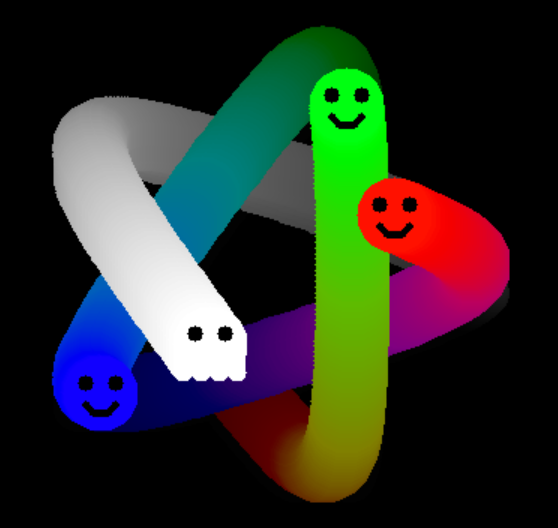

# RustGame

Inspired by [Pygame](https://www.pygame.org/news). However, [Rust](https://www.rust-lang.org/) is not [Python](https://www.python.org/) and RustGame is not Pygame.

## Rust Game SDL2

It is required to install SDL2 and OpenCV.

### Install SDL2

For the Rust SDL2 bindings [Rust-SDL2, Requirements](https://github.com/Rust-SDL2/rust-sdl2#requirements)

### Install OpenCV

For the Rust OpenCV bindings see [twistedfall/opencv-rust](https://github.com/twistedfall/opencv-rust#rust-opencv-bindings) or [Rust bindings for OpenCV 3 & 4](https://rustrepo.com/repo/twistedfall-opencv-rust-rust-image-processing#rust-opencv-bindings).

#### Rust OpenCV Windows bindings

Install LLVM from [LLVM Snapshot Builds](https://llvm.org/builds/).

Install OpenCV from [OpenCV releases](https://opencv.org/releases/)  

Set the following environment variables:

| environment variable   | path                        |
|------------------------|-----------------------------|
| `OPENCV_INCLUDE_PATHS` | .\opencv\build\include      |
| `OPENCV_LINK_PATHS`    | .\opencv\build\x64\vcXX\lib |
| `OPENCV_LINK_LIBS`     | opencv_world4XX             |
| (add to) `PATH`        | .\opencv\build\x64\vc15\bin |
